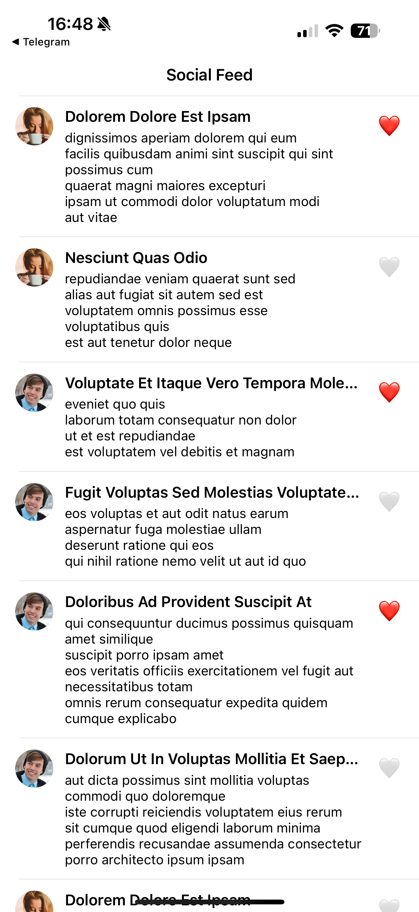
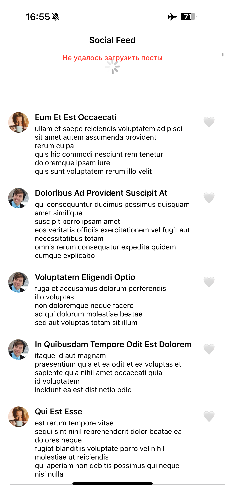

# 📱 SocialFeedApp

Простое iOS-приложение, отображающее новостную ленту с возможностью лайков и кэшированием данных с использованием Core Data.

---

## 🧩 Функциональность

- Загрузка списка постов из сети
- Аватарки пользователей
- Лайки с локальным сохранением
- Кэширование через CoreData
- Пагинация
- Обработка ошибок
- Анимации загрузки и спиннер
- Архитектура MVC + ViewModel

---

## 📸 Скриншоты

| Лента | Ошибка |
|-------|--------|
|  |  |

---

## 🛠 Технологии

- UIKit + UITableView
- Swift + MVC / ViewModel
- CoreData
- Alamofire
- URLSession (опционально)
- Image-кэш
- Автоматический layout через AutoLayout / StackView

---

## 📁 Структура проекта

SocialFeedApp/
├── Controllers/
│   └── FeedViewController.swift
├── Extensions/
│   ├── UIImageView+Load.swift
│   └── ImageCache.swift
├── Models/
│   └── Post.swift
├── Services/
│   ├── APIService.swift
│   ├── CoreDataService.swift
│   └── UserService.swift
├── ViewModels/
│   └── FeedViewModel.swift
├── Views/
│   └── PostTableViewCell.swift
├── AppDelegate.swift
├── SceneDelegate.swift
├── Info.plist
├── DataModel.xcdatamodeld
├── LaunchScreen.storyboard
└── screenshots/
├── feed.png
└── error.png

---

## 🚀 Установка

1. Склонируй репозиторий:
   ```bash
   git clone https://github.com/TaZMaN-tech/SocialFeedApp.git
2.	Установи зависимости (если используешь SPM):
   Открой .xcodeproj → File → Packages → Resolve Package Versions
3.	Собери и запусти проект в Xcode (v16.0+)

---

## ℹ️ Заметки

	•	Все данные кэшируются и доступны оффлайн
	•	Для лайков используется локальное хранилище (не отправляются на сервер)
	•	В случае ошибки отображается анимация и сообщение
